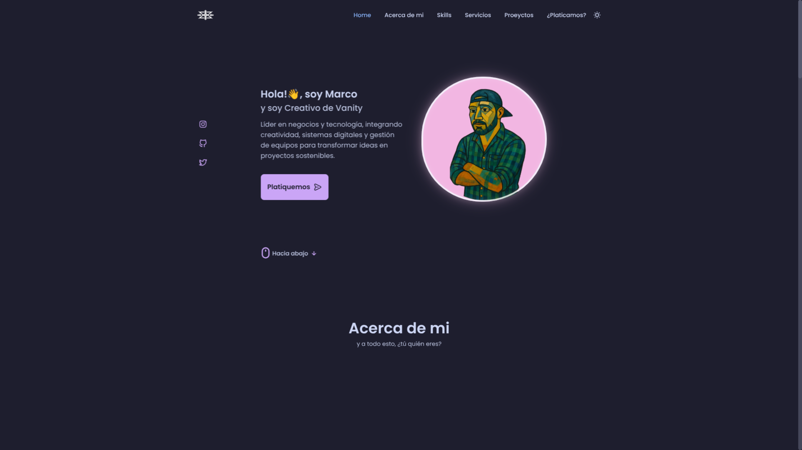

# 🚀 Marco Gallegos | Sitio Web Profesional

> **Portafolio Digital Interactivo** - Sitio web profesional de Marco Gallegos, Ingeniero en Mecatrónica convertido en polímata digital, partner en Vanity y cofundador de Aura Marketing.



## 📋 Información del Proyecto

### 🎯 Objetivo
Sitio web profesional que presenta de manera interactiva los servicios, experiencia y proyectos de Marco Gallegos, combinando diseño moderno con funcionalidades avanzadas y rendimiento optimizado.

### 🌟 Características Principales
- 🎨 **Diseño Interactivo** - Blob orgánico animado con controles dinámicos
- 🌓 **Temas Adaptativos** - Sistema dual claro/oscuro con paleta Catppuccin
- 📱 **Mobile First** - Totalmente responsivo y optimizado para móviles
- ⚡ **Alto Rendimiento** - Optimizado para Core Web Vitals y SEO
- 🎭 **Modales Interactivos** - CV completo y servicios detallados
- 🚀 **PWA Ready** - Manifests e íconos adaptativos

### 🌐 Enlaces del Sitio
- **Sitio Principal:** [marcogallegos.mx](https://marcogallegos.mx)
- **Portfolio Empresarial:** [vanityexperience.mx](https://vanityexperience.mx)
- **Agencia de Marketing:** [@tangog](https://www.instagram.com/tangog?igsh=MWMwYWQ4c2d6aGZv)

---

## 🛠️ Tecnologías Utilizadas

### 💻 Frontend Core
```
HTML5          - Estructura semántica y accesible
CSS3           - Grid, Flexbox, Custom Properties, Animaciones
JavaScript ES6+ - Manipulación DOM, APIs modernas, Módulos
```

### 📚 Librerías y Dependencias
```javascript
// Animaciones y UI
AOS (Animate On Scroll) - Animaciones al scroll
Swiper.js              - Carruseles táctiles responsivos
Typed.js               - Efectos de escritura dinámica

// Iconografía
Unicons                - Iconos de interfaz
Google Material Icons  - Iconos de sistema

// Fonts y Estilos
Google Fonts          - Tipografía web optimizada
Catppuccin Palette    - Sistema de colores moderno
```

### 🎨 Sistema de Diseño
- **Paleta de Colores:** Catppuccin (Latte para claro, Mocha para oscuro)
- **Tipografía:** Google Fonts con fallbacks optimizados
- **Metodología:** Mobile First + Progressive Enhancement
- **Arquitectura CSS:** Custom Properties + BEM naming

### 🔧 Herramientas de Desarrollo
- **Control de Versiones:** Git + GitHub
- **Desarrollo Asistido:** Claude Code AI
- **Optimización:** Minificación manual y compresión
- **Testing:** Cross-browser y responsive testing

---

## 🏗️ Arquitectura del Sitio

### 📂 Estructura de Archivos
```
mg_website/
├── index.html                 # Página principal
├── assets/
│   ├── css/
│   │   ├── style.css         # Estilos principales
│   │   └── swiper-bundle.min.css
│   ├── js/
│   │   ├── main.js           # JavaScript principal
│   │   ├── blob-controls.js  # Controles del blob interactivo
│   │   └── swiper-bundle.min.js
│   ├── img/
│   │   ├── profiles/         # Imágenes del blob (mg_1.png - mg_19.png)
│   │   ├── testimonial*.png  # Fotos de testimonios
│   │   ├── portfolio_*.png   # Capturas de proyectos
│   │   └── logos/           # Logos adaptativos
│   └── pdf/
│       └── mrinmoy-cv.pdf   # CV descargable
├── README.md
└── Favicons/               # Íconos PWA adaptativos
```

### 🎭 Componentes Principales

#### 1. **Sistema de Blob Interactivo**
```javascript
// Características técnicas del blob
const blobSystem = {
  shapes: 6,              // Formas asimétricas
  vertices: '4-12',       // Puntos controlables
  layers: 3,              // Fondo + imagen + borde
  images: 9,              // Rotación de perfiles
  morphSpeed: '4-20s',    // Velocidad de transformación
  colorSpeed: '10-30s'    // Velocidad de colores
};
```

#### 2. **Sistema de Temas**
```css
:root {
  /* Tema Claro (Catppuccin Latte) */
  --ctp-base: #eff1f5;
  --ctp-text: #4c4f69;
  
  /* Tema Oscuro (Catppuccin Mocha) */
  --ctp-base: #1e1e2e;
  --ctp-text: #cdd6f4;
}
```

#### 3. **Modales Interactivos**
- **Modal CV:** Curriculum completo con skills animados
- **Modal Servicios:** 4 servicios con detalles expandibles
- **Sistema de cierre:** Click fuera, botón X, tecla ESC

#### 4. **Sistema de Navegación**
- **Desktop:** Navegación horizontal fija
- **Mobile:** Hamburger menu adaptativo
- **Scroll:** Indicadores de sección activa

### ⚡ Funcionalidades Avanzadas

#### 🎮 Controles Dinámicos del Blob
```
Atajo: Ctrl + B
- Ajustar vértices (4-12 puntos)
- Controlar redondez (20%-80%)
- Velocidades personalizables
- Regeneración de formas
- Vista previa en tiempo real
```

#### 📊 Sistema de Skills Animados
- Barras de progreso diferidas
- Colores únicos por categoría
- Animación al expandir secciones
- Porcentajes dinámicos

#### 🌐 PWA y Optimizaciones
- Favicons adaptativos por tema
- Meta tags optimizados para SEO
- Lazy loading de imágenes
- DNS prefetch para recursos externos

#### 📧 Sistema de Contacto Avanzado
- **Formulario completo:** Nombre, correo, celular, proyecto y mensaje
- **Validación en tiempo real:** Patrones regex para cada campo
- **Integración webhook:** Conectado con n8n para automatización
- **Notificaciones visuales:** Estados de éxito, error y carga
- **Overlay de confirmación:** Información detallada post-envío
- **Endpoint:** `{webhook_url}`

---

## 🚀 Instalación y Uso

### 📋 Requisitos Previos
```bash
# No se requieren dependencias de backend
# Solo necesitas un servidor web estático
```

### ⚡ Instalación Rápida
```bash
# 1. Clonar el repositorio
git clone https://github.com/marcogll/mg_website.git
cd mg_website

# 2. Servir los archivos (usando cualquier servidor estático)
# Opción A: Python
python -m http.server 8000

# Opción B: Node.js (si tienes npm)
npx serve .

# Opción C: PHP
php -S localhost:8000

# 3. Abrir en navegador
open http://localhost:8000
```

### 🌐 Despliegue en Producción
```bash
# Para despliegue estático (GitHub Pages, Netlify, Vercel)
# 1. Subir archivos al servicio de hosting
# 2. Configurar dominio personalizado
# 3. Habilitar HTTPS
# 4. Configurar redirects para SPA

# Archivos críticos para despliegue:
# - index.html (página principal)
# - assets/ (todos los recursos)
# - favicons/ (íconos PWA)
```

### 🔧 Personalización

#### 1. **Cambiar Imágenes del Blob**
```bash
# Reemplazar imágenes en assets/img/profiles/
# Formato: PNG 512x512px con fondo transparente
# Nombres: mg_1.png, mg_2.png, ..., mg_9.png
```

#### 2. **Modificar Colores del Tema**
```css
/* En assets/css/style.css */
:root {
  --ctp-rosewater: #f5e0dc; /* Personalizar colores */
  --ctp-flamingo: #f2cdcd;
  /* ... resto de variables */
}
```

#### 3. **Configurar Información Personal**
```html
<!-- En index.html -->
<h1 class="home_title">Tu Nombre</h1>
<p class="home__description">Tu descripción</p>
<!-- Actualizar enlaces de redes sociales -->
```

### 🔍 Testing y Debugging

#### Herramientas de Desarrollo
```javascript
// Controles del blob (Ctrl + B en el navegador)
// Console debugging
console.log('Blob state:', blobConfig);

// Performance monitoring
performance.mark('page-load-start');
```

#### Testing Responsive
```bash
# Probar en diferentes dispositivos
# Desktop: 1920x1080, 1366x768
# Tablet: 768x1024, 834x1194
# Mobile: 375x667, 414x896, 360x740
```

---

## 👨‍💻 Sobre Marco Gallegos

### 🎓 Perfil Profesional
**Ingeniero en Mecatrónica** convertido en **polímata digital**. Partner en **Vanity Nail Salon** y cofundador de **Aura Marketing**. Especialista en automatización inteligente y ecosistemas digitales.

> *"Si existe una forma mejor de hacerlo, la voy a encontrar."*

### 📊 En Números
- **15+** años de experiencia industrial
- **2** empresas fundadas y co-fundadas  
- **∞** aprendizaje continuo y adaptación

### 🛠️ Áreas de Expertise

#### 💻 Tecnología & Desarrollo (88%)
- Infraestructura VPS & Docker
- Automatización con n8n
- IoT aplicado a negocios
- Sistemas Web Full-Stack

#### 🏗️ Ingeniería & Manufactura (92%)
- Moldeo científico certificado
- Lean Manufacturing & 5S
- Troubleshooting de procesos
- Program Management

#### 🎨 Marketing & Creatividad (87%)
- Estrategias de posicionamiento
- Contenido visual anime-style
- Producción audiovisual
- Análisis de mercado con IA

#### 👔 Gestión Empresarial (85%)
- Liderazgo de equipos multidisciplinarios
- Estandarización de procesos
- Gestión financiera
- Desarrollo de nuevos negocios

---

## 🏆 Proyectos Destacados

### 🌐 **Ecosistemas Digitales**
- Infraestructura VPS completa con Docker
- Sistemas POS & CRM integrados
- Automatización de procesos con n8n + IA

### ⚡ **Hardware & IoT**
- Mesas inteligentes con ESP32
- Sistemas de control empresarial
- Automatización de inventarios

### 🎨 **Marketing & Contenido**
- Estrategias anime-style para +20 marcas
- ROI superior al 300% en campañas
- Red de colaboradores y talentos

### 💅 **Vanity Nail Salon (Partner)**
- 45% incremento en ventas post-automatización
- Sistema POS personalizado
- Chatbot WhatsApp para reservas
- Control multi-sucursal

---

## 📧 Contacto y Colaboración

### 🤝 ¿Interesado en Colaborar?
Desarrollo soluciones completas para:
- **Ecosistemas digitales** empresariales
- **Automatización inteligente** de procesos
- **Desarrollo IoT** aplicado a negocios
- **Estrategias de crecimiento** con tecnología

### 📞 Canales de Contacto
- **Email:** marco@vanityexperience.mx
- **GitHub:** [github.com/marcogll](https://github.com/marcogll)
- **LinkedIn:** Conexión profesional disponible
- **Instagram Aura:** [@tangog](https://www.instagram.com/tangog?igsh=MWMwYWQ4c2d6aGZv)

---

## 📋 Roadmap y Mejoras Futuras

### 🚧 En Desarrollo Activo
- [x] **Sistema de notificaciones** - Confirmación de envío de mensajes ✅
- [x] **Validación avanzada** - Feedback visual en formularios ✅
- [x] **Respuestas automáticas** - Sistema de confirmación personalizado ✅
- [ ] **Analytics de formulario** - Métricas de conversión de contacto

### 🎯 Próximas Funcionalidades
- [ ] **Blog técnico** - Casos de estudio y artículos
- [ ] **Galería interactiva** - Showcase expandible de proyectos
- [ ] **Sistema de comentarios** - Feedback de visitantes
- [ ] **Analytics avanzados** - Métricas de conversión

### ⚡ Optimizaciones Planificadas
- [ ] **Service Worker** - Caché estratégico offline
- [ ] **WebP + AVIF** - Formatos de imagen modernos
- [ ] **Code Splitting** - Carga bajo demanda
- [ ] **A11y Improvements** - Navegación por teclado completa

---

## 🤖 Desarrollo y Créditos

**Desarrollado con [Claude Code](https://claude.ai/code)** - Asistencia de IA para desarrollo frontend

### 🎨 Recursos y Referencias
- **Paleta de Colores:** [Catppuccin](https://github.com/catppuccin/catppuccin)
- **Iconografía:** [Unicons](https://iconscout.com/unicons) + [Google Material](https://fonts.google.com/icons)
- **Animaciones:** [AOS Library](https://michalsnik.github.io/aos/)
- **Carruseles:** [Swiper.js](https://swiperjs.com/)

---

## 📄 Licencia

© 2025 Marco Gallegos. Todos los derechos reservados.

*Transformando ideas en proyectos sostenibles que conectan creatividad, tecnología y gestión empresarial.*

---

## 🔗 Enlaces Útiles

| Categoría | Enlace | Descripción |
|-----------|--------|-------------|
| **🏠 Principal** | [marcogallegos.mx](https://marcogallegos.mx) | Sitio web profesional |
| **💅 Vanity** | [vanityexperience.mx](https://vanityexperience.mx) | Portfolio empresarial |
| **🎨 Aura** | [@tangog](https://www.instagram.com/tangog?igsh=MWMwYWQ4c2d6aGZv) | Agencia de marketing |
| **👨‍💻 GitHub** | [github.com/marcogll](https://github.com/marcogll) | Repositorios y código |
| **📧 Contacto** | marco@vanityexperience.mx | Email profesional |

*README actualizado: Enero 2025*